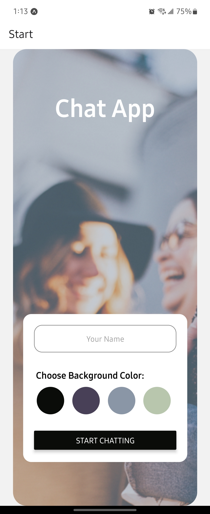
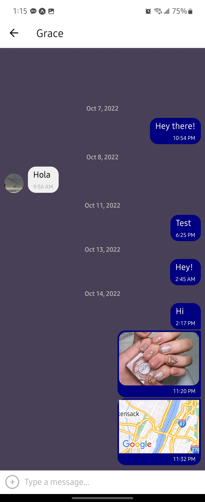

## Chat App

This chat app was built using React Native, Expo, and Google Firestore Database. The main features are to provide users with a chat interface and options to share images as well as their location.

 

## Instructions

1. In order to run this application, you will need to make sure you have a recent version of Node.js & Expo CLI on your PC as well as the [Expo Go app](https://expo.dev/client) on your phone or emulator such as [Android Studio](https://developer.android.com/studio). 
2. Then you can clone this repository, open the project's root folder using your preferred IDE and install all the dependencies listed in the "package.json" file by running `npm install` in the terminal. 
3. Finally, launch the app locally using `npm start` or `expo start` in the terminal. You may connect your phone to your PC via USB or open your preferred emulator to run the app.

## Dependencies Used

`"dependencies": {
    "@expo/webpack-config": "^0.17.0",
    "@react-native-async-storage/async-storage": "~1.17.3",
    "@react-native-community/masked-view": "^0.1.11",
    "@react-native-community/netinfo": "9.3.0",
    "@react-navigation/native": "^6.0.13",
    "@react-navigation/stack": "^6.3.0",
    "expo": "~46.0.9",
    "expo-image-picker": "~13.3.1",
    "expo-location": "~14.3.0",
    "expo-permissions": "~13.2.0",
    "expo-status-bar": "~1.4.0",
    "firebase": "^8.2.3",
    "react": "18.0.0",
    "react-dom": "18.0.0",
    "react-native": "0.69.6",
    "react-native-gesture-handler": "~2.5.0",
    "react-native-gifted-chat": "^1.0.4",
    "react-native-maps": "0.31.1",
    "react-native-reanimated": "~2.9.1",
    "react-native-safe-area-context": "^4.3.1",
    "react-native-screens": "~3.15.0",
    "react-native-web": "~0.18.7",
    "react-navigation": "^4.4.4"
  },
  "devDependencies": {
    "@babel/core": "^7.12.9"
  },`

## Key Features

- A page where users can enter their name and choose a background color for the chat screen before joining the chat.
- A page displaying the conversation, as well as an input field and submit button.
- The chat must provide users with two additional communication features: sending images and location data.
- Data gets stored online and offline.
